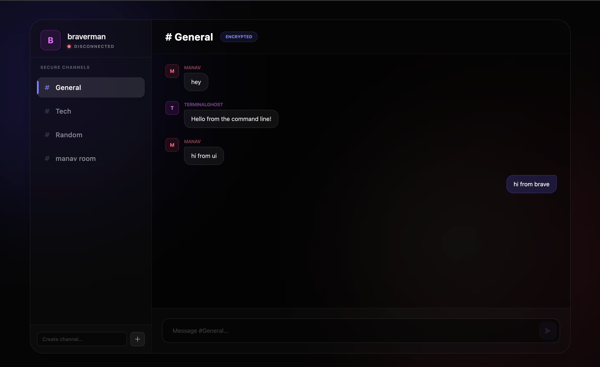
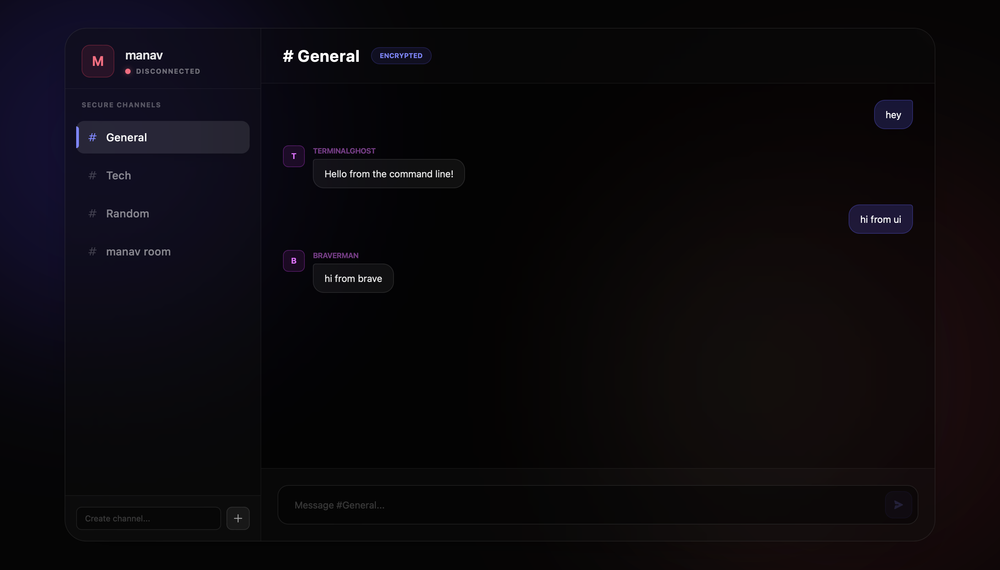
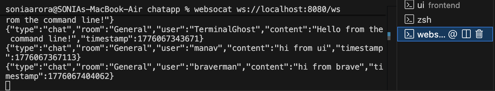

# GoChat - High-Performance WebSocket Chat

A production-grade, multi-room chat application built with **Go** (Backend) and **React + Tailwind CSS** (Frontend). Designed with scalability in mind, it features a concurrent Hub & Client architecture, structured logging, and graceful shutdown capabilities.

---

## 🚀 Usage

First, ensure the Go backend is running:
```bash
# From the root of the project
go run cmd/chat-server/*.go
```

The server will start on `http://127.0.0.1:8080`.

### Option 1: Terminal (via Websocat)
You can interact directly with the WebSocket server using `websocat`, which is great for debugging or building bot integrations.

1. Connect to the WebSocket endpoint:
   ```bash
   websocat ws://127.0.0.1:8080/ws
   ```
2. **Join a Room**: The server expects a JSON envelope. To join a room and receive the message history, paste the following and hit `Enter`:
   ```json
   {"type": "join", "room": "General", "user": "TerminalGhost", "content": ""}
   ```
3. **Send a Message**: To broadcast a message to everyone in that room:
   ```json
   {"type": "chat", "room": "General", "user": "TerminalGhost", "content": "Hello from the command line!"}
   ```

### Option 2: Web Interface (React)
The project includes a sleek, glassmorphic UI built with Vite and Tailwind v4.

1. Open a new terminal and navigate to the frontend:
   ```bash
   cd frontend
   npm install
   ```
2. Start the development server:
   ```bash
   npm run dev
   ```
3. Open `http://127.0.0.1:5173` in multiple browser tabs to simulate different users. Type in a username, join a secure channel, and chat in real-time!

---

## 🏗 Architecture & Features

### Backend (Go)
- **Concurrent Hub Strategy**: Instead of broadcasting to all connected users, the `Hub` maintains separate `map[*Client]bool` buckets for individual rooms, ensuring O(1) targeted message delivery.
- **In-Memory History**: The server retains the last 50 messages per room, dispatching them sequentially to newly joined clients for a seamless UX.
- **Deduplication**: Every message is stamped with a Unix Milli timestamp (`time.Now().UnixMilli()`) at the server level, guaranteeing unique message keys on the frontend.
- **Graceful Shutdown**: Utilizes `context.WithTimeout` and `os.Signal` to catch interrupt signals (`SIGTERM`, `SIGINT`), flushing active connections and shutting down cleanly.

### Frontend (React + Vite)
- **Custom WebSocket Hook**: Connection lifecycle is abstracted into `useWebSocket.js`, preventing memory leaks and managing component re-renders.
- **Dynamic State**: Supports on-the-fly room creation mapped directly to the Go server's dynamic map allocation.
- **Modern UI**: Styled strictly with functional Tailwind CSS utilities, featuring backdrop-blurs, glowing accents based on hashed usernames, and a custom scrollbar.

## 📁 Directory Structure
```text
.
├── cmd/
│   └── chat-server/    # Application entrypoint (main.go, api.go)
├── internal/
│   ├── config/         # Environment configurations & CORS setup
│   └── websocket/      # Core real-time logic (hub.go, client.go, message.go)
├── frontend/           # React SPA
│   ├── src/
│   │   ├── hooks/      # useWebSocket abstraction
│   │   ├── App.jsx     # Main UI
│   │   └── index.css   # Tailwind entry setup
│   └── package.json
└── go.mod              # Go dependencies
```


### UI Screenshots


